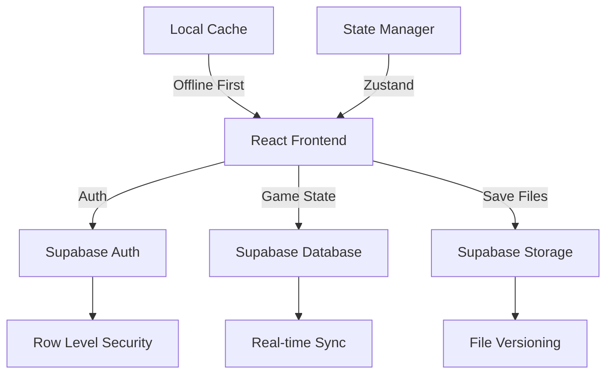

# Cloud Architecture Migration Plan

## Executive Summary
**Goal:** Migrate from LocalStorage to Supabase cloud infrastructure  
**Timeline:** 2-3 weeks  
**Cost:** $0 (Free tier supports 50K MAU)  
**Risk Level:** Low (incremental migration possible)

## Architecture Overview



## Phase 1: Foundation (Week 1)

### Day 1-2: Supabase Setup

```bash
# Install dependencies
bun add @supabase/supabase-js zustand react-query
bun add -D @types/node
```

```typescript
// src/lib/supabase.ts
import { createClient } from '@supabase/supabase-js'

const supabaseUrl = import.meta.env.VITE_SUPABASE_URL
const supabaseAnonKey = import.meta.env.VITE_SUPABASE_ANON_KEY

export const supabase = createClient(supabaseUrl, supabaseAnonKey, {
  auth: {
    persistSession: true,
    autoRefreshToken: true,
  },
  global: {
    headers: {
      'x-game-version': '1.0.0'
    }
  }
})
```

### Day 3-4: Database Schema

```sql
-- Enable UUID extension
CREATE EXTENSION IF NOT EXISTS "uuid-ossp";

-- Users table extended
CREATE TABLE profiles (
  id UUID REFERENCES auth.users PRIMARY KEY,
  username TEXT UNIQUE,
  created_at TIMESTAMPTZ DEFAULT NOW(),
  settings JSONB DEFAULT '{}',
  stats JSONB DEFAULT '{
    "play_time": 0,
    "battles_won": 0,
    "creatures_caught": 0
  }'
);

-- Save slots table
CREATE TABLE save_slots (
  id UUID DEFAULT uuid_generate_v4() PRIMARY KEY,
  user_id UUID REFERENCES auth.users NOT NULL,
  slot_number INT NOT NULL CHECK (slot_number BETWEEN 1 AND 3),
  slot_name TEXT DEFAULT 'New Game',
  game_state JSONB NOT NULL,
  play_time INT DEFAULT 0,
  last_saved TIMESTAMPTZ DEFAULT NOW(),
  created_at TIMESTAMPTZ DEFAULT NOW(),
  version TEXT NOT NULL DEFAULT '1.0.0',
  is_active BOOLEAN DEFAULT TRUE,
  thumbnail JSONB, -- Store team preview
  UNIQUE(user_id, slot_number)
);

-- Save backups (auto-saves)
CREATE TABLE save_backups (
  id UUID DEFAULT uuid_generate_v4() PRIMARY KEY,
  save_slot_id UUID REFERENCES save_slots NOT NULL,
  game_state JSONB NOT NULL,
  backup_type TEXT CHECK (backup_type IN ('auto', 'manual', 'checkpoint')),
  created_at TIMESTAMPTZ DEFAULT NOW()
);

-- Shared creatures (for trading simulation)
CREATE TABLE creature_bank (
  id UUID DEFAULT uuid_generate_v4() PRIMARY KEY,
  user_id UUID REFERENCES auth.users NOT NULL,
  creature_data JSONB NOT NULL,
  is_tradeable BOOLEAN DEFAULT FALSE,
  created_at TIMESTAMPTZ DEFAULT NOW()
);

-- Achievement tracking
CREATE TABLE achievements (
  id UUID DEFAULT uuid_generate_v4() PRIMARY KEY,
  user_id UUID REFERENCES auth.users NOT NULL,
  achievement_id TEXT NOT NULL,
  unlocked_at TIMESTAMPTZ DEFAULT NOW(),
  save_slot_id UUID REFERENCES save_slots,
  UNIQUE(user_id, achievement_id)
);

-- Row Level Security
ALTER TABLE save_slots ENABLE ROW LEVEL SECURITY;
ALTER TABLE save_backups ENABLE ROW LEVEL SECURITY;
ALTER TABLE profiles ENABLE ROW LEVEL SECURITY;

-- Policies
CREATE POLICY "Users can CRUD own saves" ON save_slots
  FOR ALL USING (auth.uid() = user_id);

CREATE POLICY "Users can read own backups" ON save_backups
  FOR SELECT USING (
    save_slot_id IN (
      SELECT id FROM save_slots WHERE user_id = auth.uid()
    )
  );
```

### Day 5: Auth Implementation

```typescript
// src/hooks/useAuth.ts
import { useEffect } from 'react'
import { create } from 'zustand'
import { supabase } from '@/lib/supabase'

interface AuthState {
  user: User | null
  session: Session | null
  loading: boolean
  signIn: (email: string, password: string) => Promise<void>
  signUp: (email: string, password: string) => Promise<void>
  signOut: () => Promise<void>
  signInWithProvider: (provider: 'google' | 'github') => Promise<void>
}

export const useAuth = create<AuthState>((set) => ({
  user: null,
  session: null,
  loading: true,
  
  signIn: async (email, password) => {
    const { data, error } = await supabase.auth.signInWithPassword({
      email,
      password,
    })
    if (error) throw error
    set({ user: data.user, session: data.session })
  },
  
  signUp: async (email, password) => {
    const { data, error } = await supabase.auth.signUp({
      email,
      password,
      options: {
        emailRedirectTo: `${window.location.origin}/welcome`
      }
    })
    if (error) throw error
    set({ user: data.user, session: data.session })
  },
  
  signOut: async () => {
    await supabase.auth.signOut()
    set({ user: null, session: null })
  },
  
  signInWithProvider: async (provider) => {
    const { error } = await supabase.auth.signInWithOAuth({
      provider,
      options: {
        redirectTo: `${window.location.origin}/game`
      }
    })
    if (error) throw error
  }
}))

// Auth state listener
supabase.auth.onAuthStateChange((event, session) => {
  useAuth.setState({ 
    user: session?.user ?? null,
    session,
    loading: false 
  })
})
```

## Phase 2: Save System (Week 1-2)

### Cloud Save Manager

```typescript
// src/services/cloudSaveManager.ts
import { GameState } from '@/game/types'
import { supabase } from '@/lib/supabase'

export class CloudSaveManager {
  private localCache: Map<number, GameState> = new Map()
  private syncQueue: Set<number> = new Set()
  private autoSaveInterval?: NodeJS.Timeout
  
  async loadSlot(slotNumber: number): Promise<GameState | null> {
    // Check cache first
    if (this.localCache.has(slotNumber)) {
      return this.localCache.get(slotNumber)!
    }
    
    const { data, error } = await supabase
      .from('save_slots')
      .select('game_state')
      .eq('slot_number', slotNumber)
      .single()
    
    if (error) {
      console.error('Failed to load save:', error)
      return this.loadFromLocalStorage(slotNumber) // Fallback
    }
    
    const gameState = data.game_state as GameState
    this.localCache.set(slotNumber, gameState)
    return gameState
  }
  
  async saveSlot(slotNumber: number, gameState: GameState): Promise<void> {
    // Save to cache immediately
    this.localCache.set(slotNumber, gameState)
    this.saveToLocalStorage(slotNumber, gameState) // Backup
    
    // Queue for sync
    this.syncQueue.add(slotNumber)
    
    // Debounced cloud save
    this.scheduleSyncToCloud()
  }
  
  private scheduleSyncToCloud = debounce(async () => {
    const slots = Array.from(this.syncQueue)
    this.syncQueue.clear()
    
    await Promise.all(slots.map(slot => this.syncSlotToCloud(slot)))
  }, 5000) // 5 second debounce
  
  private async syncSlotToCloud(slotNumber: number): Promise<void> {
    const gameState = this.localCache.get(slotNumber)
    if (!gameState) return
    
    const { error } = await supabase
      .from('save_slots')
      .upsert({
        slot_number: slotNumber,
        game_state: gameState,
        last_saved: new Date().toISOString(),
        play_time: gameState.playTime,
        thumbnail: this.generateThumbnail(gameState)
      })
    
    if (error) {
      console.error('Sync failed:', error)
      this.syncQueue.add(slotNumber) // Retry later
    }
  }
  
  private generateThumbnail(state: GameState) {
    return {
      team: state.creatures.slice(0, 6).map(c => ({
        species: c.speciesId,
        level: c.level
      })),
      badges: state.badges.length,
      location: state.location.areaId
    }
  }
  
  // Auto-save every 60 seconds
  startAutoSave(slotNumber: number) {
    this.stopAutoSave()
    this.autoSaveInterval = setInterval(() => {
      const state = this.localCache.get(slotNumber)
      if (state) {
        this.createBackup(slotNumber, state, 'auto')
      }
    }, 60000)
  }
  
  stopAutoSave() {
    if (this.autoSaveInterval) {
      clearInterval(this.autoSaveInterval)
    }
  }
  
  private async createBackup(
    slotNumber: number, 
    state: GameState, 
    type: 'auto' | 'manual' | 'checkpoint'
  ) {
    const { data: slot } = await supabase
      .from('save_slots')
      .select('id')
      .eq('slot_number', slotNumber)
      .single()
    
    if (slot) {
      await supabase
        .from('save_backups')
        .insert({
          save_slot_id: slot.id,
          game_state: state,
          backup_type: type
        })
      
      // Keep only last 5 auto-saves
      if (type === 'auto') {
        this.pruneOldBackups(slot.id)
      }
    }
  }
  
  // Migration helper
  async migrateFromLocalStorage() {
    const oldSaves = this.getAllLocalSaves()
    
    for (const [slot, state] of oldSaves) {
      await this.saveSlot(slot, state)
    }
    
    // Clear localStorage after successful migration
    localStorage.removeItem('pokeclone_saves')
  }
}

export const saveManager = new CloudSaveManager()
```

### Offline-First Sync

```typescript
// src/hooks/useGameSync.ts
import { useEffect } from 'react'
import { useQuery, useMutation, useQueryClient } from 'react-query'
import { saveManager } from '@/services/cloudSaveManager'

export function useGameSync(slotNumber: number) {
  const queryClient = useQueryClient()
  
  // Load save
  const { data: gameState, isLoading } = useQuery(
    ['save', slotNumber],
    () => saveManager.loadSlot(slotNumber),
    {
      staleTime: Infinity, // Never stale
      cacheTime: Infinity, // Keep in cache
      retry: 3,
      retryDelay: attemptIndex => Math.min(1000 * 2 ** attemptIndex, 30000),
    }
  )
  
  // Save mutation
  const saveMutation = useMutation(
    (newState: GameState) => saveManager.saveSlot(slotNumber, newState),
    {
      onMutate: async (newState) => {
        // Optimistic update
        await queryClient.cancelQueries(['save', slotNumber])
        const previousState = queryClient.getQueryData(['save', slotNumber])
        queryClient.setQueryData(['save', slotNumber], newState)
        return { previousState }
      },
      onError: (err, newState, context) => {
        // Rollback on error
        queryClient.setQueryData(['save', slotNumber], context?.previousState)
      },
      onSettled: () => {
        queryClient.invalidateQueries(['save', slotNumber])
      }
    }
  )
  
  // Online/offline detection
  useEffect(() => {
    const handleOnline = () => {
      // Sync when coming back online
      saveManager.syncAllPending()
    }
    
    window.addEventListener('online', handleOnline)
    return () => window.removeEventListener('online', handleOnline)
  }, [])
  
  return {
    gameState,
    isLoading,
    save: saveMutation.mutate,
    isSaving: saveMutation.isLoading,
    lastSyncError: saveMutation.error
  }
}
```

## Phase 3: Import/Export System (Week 2)

### Save File Import/Export

```typescript
// src/services/saveImportExport.ts
export class SaveImportExport {
  static async exportSave(slotNumber: number): Promise<void> {
    const state = await saveManager.loadSlot(slotNumber)
    if (!state) throw new Error('No save found')
    
    const exportData = {
      version: '1.0.0',
      exported: new Date().toISOString(),
      gameState: state,
      checksum: this.generateChecksum(state)
    }
    
    const blob = new Blob([JSON.stringify(exportData, null, 2)], {
      type: 'application/json'
    })
    
    const url = URL.createObjectURL(blob)
    const a = document.createElement('a')
    a.href = url
    a.download = `pokeclone-save-${Date.now()}.json`
    a.click()
    URL.revokeObjectURL(url)
  }
  
  static async importSave(file: File, targetSlot: number): Promise<void> {
    const text = await file.text()
    const importData = JSON.parse(text)
    
    // Validate
    if (!this.validateImport(importData)) {
      throw new Error('Invalid save file')
    }
    
    // Check version compatibility
    if (!this.isVersionCompatible(importData.version)) {
      const migrated = await this.migrateSave(importData)
      await saveManager.saveSlot(targetSlot, migrated.gameState)
    } else {
      await saveManager.saveSlot(targetSlot, importData.gameState)
    }
  }
  
  private static generateChecksum(state: GameState): string {
    const str = JSON.stringify(state)
    let hash = 0
    for (let i = 0; i < str.length; i++) {
      const char = str.charCodeAt(i)
      hash = ((hash << 5) - hash) + char
      hash = hash & hash
    }
    return hash.toString(36)
  }
  
  private static validateImport(data: any): boolean {
    return (
      data?.version &&
      data?.gameState &&
      data?.checksum === this.generateChecksum(data.gameState)
    )
  }
}
```

## Phase 4: Multi-Device Sync (Week 2-3)

### Real-time Sync

```typescript
// src/hooks/useRealtimeSync.ts
export function useRealtimeSync(slotNumber: number) {
  useEffect(() => {
    const channel = supabase
      .channel(`save-${slotNumber}`)
      .on('postgres_changes', {
        event: 'UPDATE',
        schema: 'public',
        table: 'save_slots',
        filter: `slot_number=eq.${slotNumber}`
      }, (payload) => {
        // Another device updated the save
        handleRemoteUpdate(payload.new)
      })
      .subscribe()
    
    return () => {
      supabase.removeChannel(channel)
    }
  }, [slotNumber])
  
  function handleRemoteUpdate(remoteSave: any) {
    // Conflict resolution strategy
    const localState = saveManager.getLocalState(slotNumber)
    
    if (localState.timestamp < remoteSave.last_saved) {
      // Remote is newer
      if (confirm('Save updated on another device. Load newer save?')) {
        saveManager.loadSlot(slotNumber, { force: true })
      }
    }
  }
}
```

## Migration Timeline

### Week 1: Core Infrastructure
- [x] Day 1-2: Supabase setup
- [ ] Day 3-4: Database schema
- [ ] Day 5: Auth implementation

### Week 2: Save System
- [ ] Day 1-2: CloudSaveManager
- [ ] Day 3-4: Offline sync
- [ ] Day 5: Testing & debugging

### Week 3: Advanced Features  
- [ ] Day 1-2: Import/Export
- [ ] Day 3-4: Real-time sync
- [ ] Day 5: Migration from localStorage

## Cost Analysis

### Supabase Free Tier Limits
- **Database:** 500MB (supports ~500K saves)
- **Storage:** 1GB (save backups)
- **Auth:** 50,000 MAU
- **Bandwidth:** 2GB/month
- **Edge Functions:** 500K invocations

**Estimated Usage:**
- 1000 players × 3 saves × 50KB = 150MB database
- 1000 players × 10 backups × 50KB = 500MB storage
- **Verdict:** Free tier sufficient until 5000+ active players

## Rollback Strategy

```typescript
// Keep localStorage as fallback
class HybridSaveManager {
  async save(slot: number, state: GameState) {
    // Always save locally first
    localStorage.setItem(`save_${slot}`, JSON.stringify(state))
    
    try {
      // Then try cloud
      await this.cloudSave(slot, state)
    } catch (error) {
      console.warn('Cloud save failed, using local only', error)
    }
  }
  
  async load(slot: number): Promise<GameState> {
    try {
      // Try cloud first
      return await this.cloudLoad(slot)
    } catch (error) {
      // Fallback to local
      return this.localLoad(slot)
    }
  }
}
```

## Success Metrics

- [ ] 100% of saves synced within 10 seconds
- [ ] Zero data loss during migration
- [ ] <500ms save operation latency
- [ ] Offline play fully functional
- [ ] Import/export working for all saves

---

*Migration Plan Created: 2025-08-07*  
*Next: Dark Narrative System Design*